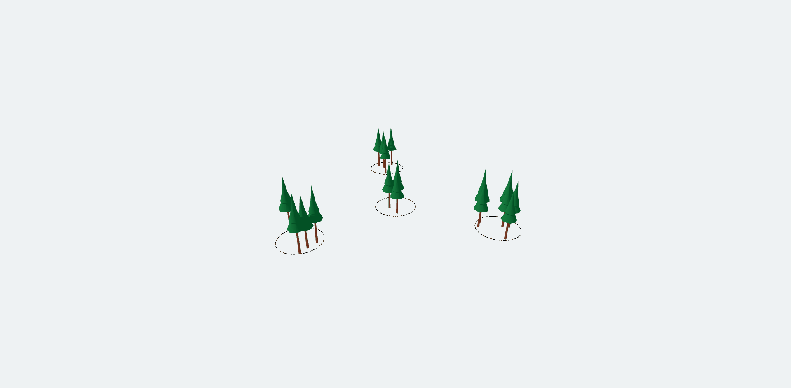

# forest_visuals




This repository is a collection of 3D assets for the purpose of visualizing
forestry concepts.

## Installation

This project uses npm to manage dependencies. You will need to have node.js
installed on your system.

```bash
git clone https://github.com/brycefrank/forest_visuals.git
cd forest_visuals
npm install
```

To view assets run

```bash
npm run start
```